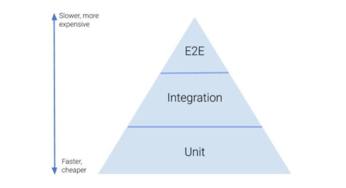
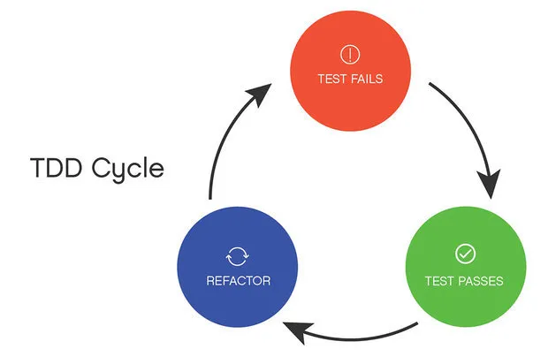

<style scoped>
section {
    font-size: xx-large;
    text-align: center;
    padding-top: 25%;
    padding-bottom: 25%;
}
</style>

# Unit Testing & TDD

---

# Introduction

This is a workshop about automated testing with the focus on unit testing and Test-driven development

#### Modules

1. Basics
2. Techniques of Unit Testing and TDD
3. Unit Testing in legacy software

Each module ends with a practice example

After each practice example there will be a break.

---

# Module 1: Basics

__Part 1: Theory__
- Automated testing overview
- Terminology
- White-Box vs Black-Box testing
- What is unit testing and why would you want to use it?
- What is TDD and why would you want to do practice it?

__Part 2: First practice example__
- Presentation of the first practice example
- Practice (~ 30 minutes)
- Discussion and presentation phase, including "model solution"

---

# Module 2: Techniques of Unit Testing

__Part 1: Techniques of Unit Testing and TDD__
- Writing testable code
- Test Doubles
- Organizing tests

__Part 2: Second practice example__
- Presentation of the second practice example
- Practice (~ 30 minutes)
- Discussion and presentation phase, including "model solution"

---

# Module 3: Unit Testing in legacy Software

__Part 1: Unit Testing in Legacy software__
- What is legacy software in the context of Unit testing?
- Techniques to get legacy code tested

__Part 2: Third practice example__
- Presentation of the third practice example
- Practice (~ 30 minutes)
- Discussion and presentation phase, including "model solution"

---

# Appendix

1. Sources
2. Discussion and Feedback

---

<style scoped>
section {
    font-size: xx-large;
    text-align: center;
    padding-top: 25%;
    padding-bottom: 25%;
}
</style>

# Module 1: Basics

---

# Module 1: Basics - Overview

#### Part 1: Theory
- Automated testing overview
- Terminology
- White-Box vs Black-Box testing
- What is unit testing and why would you want to use it?
- What is TDD and why would you want to do practice it?

#### Part 2: Practice
- Presentation of the practice example
- Practice (~ 30 minutes)
- Discussion and presentation phase, including "model solution" 

---

# Module 1 - Automated testing

- Different use cases require different kind of tests
- Three main kinds of testing: Unit, Integration / Functional, End-2-End



---

# Module 1 - Terminology

__System-Under-Test (SUT)__: The system you want to test (eg. a single unit or a whole system)

__Unit-Under-Test__: The SUT in the context of a unit test

__Unit__: A small component of an application. Usually a class, method, or function. In Unit testing also SUT

__White-Box-Testing__: The test case knows about the inner workings of a SUT

__Black-Box-Testing__: The test case does not know about the inner workings of a SUT

__Assertion__: A check if an expectation was true.

__Fixture__: The known state of the application or world, that needs to be set up before a test

__Test Doubles__: Stand-In classes for actual dependencies of the SUT. More on this topic in Module 2

__Data Provider__: Provide input data and expectations for the input data. Used to test more cases with the same test

---

# Module 1 - White Box vs Black Box Testing

#### When to use White-Box-Testing?
- When the SUT doesn't return a value
- When a test has to make sure specific methods on a dependency are called
- When the _behaviour_ of a SUT should be tested

_Techniques for White-Box-Testing will be discussed in the second module_

#### When to use Black-Box-Testing?
- When the SUT returns a value
- When a test doesn't need to make sure specific methods on a dependency are called
- When the resulting _state_ of a SUT should be tested


```
As a general rule of thumb, try to test as much as possible by implementing
Black-Box-Testing. Good black-box tests are much more stable, than white-box tests.
```

---

# Module 1 - What is unit testing?

- Unit Tests test small components of a software
- They test them in isolation of the rest of the software
- They are fast
- They are automated

---

# Module 1 - Why would you want to use Unit Testing?

- Code becomes more reliable 
- Reduces code complexity
- Bugs are found easier and quicker
- Quality of code rises
- Give documentation

---

# Module 1 - What is Test-driven development?

> Test-driven development (__TDD__) is a sofware development process relying on software requirements being converted to test cases before software is fully developed, and tracking all software development by repeatedly testing the software against all test cases. This is opposed to software being developed first and test cases created later.  
> -- *Wikipedia*

--- 

# Module 1 - What is Test-driven development?

- Tests are written before implementations
- Only one requirement is tested, then implemented, repeating until all requirements are implemented



---

# Module 1 - Why would you want to practice TDD?

- Focus shifts from implementation to usability
- Simplifies code
- Results in more modular code, which makes software easier to extend
- Documentation is always up-to-date
- Shortens development time, because more there's more focus on accomplishing goals

---

# Module 1 - First practice example

#### Setup

Clone the practice repository:

`git clone git@github.com:lukaslangen/workshop-unittesting-practice-examples.git`

Checkout the first-example tag:

`git checkout first-example`

---

# Module 1 - First practice example

#### Task

Implement the `FirstExample::getMonths()` method by using a test-driven approach

You may need to use the following techniques and methods and classes:

- `\PhpUnit\Framework\TestCase::assertEquals()`
- `\PhpUnit\Framework\TestCase::assertCount()`
- `\Lcobucci\FrozenClock::class`
- `dataProviders`

---

<style scoped>
section {
    font-size: xx-large;
    text-align: center;
    padding-top: 25%;
    padding-bottom: 25%;
}
</style>

# Module 1 - First practice example

_~ 30 minutes_

---

<style scoped>
section {
    font-size: xx-large;
    text-align: center;
    padding-top: 25%;
    padding-bottom: 25%;
}
</style>

# Module 1 - Discussion and Model Solution

---

<style scoped>
section {
    font-size: xx-large;
    text-align: center;
    padding-top: 25%;
    padding-bottom: 25%;
}
</style>

# Module 2: Techniques of Unit Testing

---

# Module 2: Techniques of Unit Testing

__Part 1: Techniques of Unit Testing and TDD__
- Writing testable code
- Test Doubles
- Organizing tests

__Part 2: Second practice example__
- Presentation of the second practice example
- Practice (~ 30 minutes)
- Discussion and presentation phase, including "model solution"

---

# Module 2 - Writing testable code

__No side effects__: A unit should not be the cause of side effects like I/O.

__Extraction of non-testables into Wrappers__: I/O operations, database connections, etc. should be extracted in wrapper classes. This solves the "No side effects"

__IoC / DI__: Classes should adhere to the IoC principle by implementing the DI pattern.

__Single Responsibility__: A unit should be short and do only one thing

__Sparse usage of static__: Static methods are hard to mock. Static variables have global state and should be avoided where possible

__Test Driven Development__: If code is developed using TDD the implementation is testable by design.

---

# Module 2 - Test Doubles

Test Doubles are frequently used in unit testing. There are different types of test doubles:

__Dummy__: An object that is passed into a class, but never used in the context of the specific test case.

__Fake__: An object that has a working implementation, but takes shortcuts designed for testing, not for production code.

__Stub__: An object that provides known return values for calls made during the test.

__Spy__: A stub that also records information on how they are called.

__Mock__: An object that is pre-programmed with expectations for the unit under test's behaviour

Test Doubles are at least one or multiple of the above, with the exception of dummies. A dummy can only be a dummy.

---

# Module 2 - Test Doubles

### Examples

```php
class SomeValueObject 
{
    public $id;
    public $value;
}

interface Repository
{
    public function save(SomeValueObject $object): void;

    public function read(int $id): SomeValueObject;
}

class UnitUnderTest
{
    public function __construct(Repository $repository) {}

    public function doStuffThatNeedsRepository(): void {}

    public function doStuffThatDoesntNeedRepository(): void {}
}
```

---

# Module 2 - Test Doubles

### Dummy Example

```php
class DummyRepository implements Repository
{
    public function save(SomeValueObject $object): void {}

    public function read(int $id): SomeValueObject { return new SomeValueObject(); }
}

// In the test:

$uut = new UnitUnderTest(new DummyRepository());
$uut->doStuffThatDoesntNeedRepository();
```

---

# Module 2 - Test Doubles

### Fake Example

```php
class FakeRepository implements Repository
{
    private $store = [];

    public function save(SomeValueObject $object): void
    {
        $this->store[$object->id] = $object;
    }

    public function read(int $id): SomeValueObject
    {
        return $this->store[$id];
    }
}

// In the test:

$uut = new UnitUnderTest(new FakeRepository());
$uut->doStuffThatNeedsRepository();
```

---

# Module 2 - Test Doubles

### Stub Example

```php
class StubRepository implements Repository
{
    public function save(SomeValueObject $object): void
    {
        // do nothing
    }

    public function read(int $id): SomeValueObject
    {
        $object = new SomeValueObject();
        $object->id = $id;
        $object->value = 'some value';

        return $object;
    }
}

// In the test:

$uut = new UnitUnderTest(new StubRepository());
$uut->doStuffThatDoesntNeedRepository();
```

---

# Module 2 - Test Doubles

### Spy Example

```php
class SpyRepository implements Repository
{
    public $callCount = 0;

    public function save(SomeValueObject $object): void
    {
        $this->callCount++;
    }

    public function read(int $id): SomeValueObject { return new SomeValueObject(); }
}

// In the test

$spy = new SpyRepository();
$uut = new UnitUnderTest($spy);
$uut->doStuffThatNeedsRepository();

$this->assertSame(3, $spy->callCount);
```

---

# Module 2 - Test Doubles

### Mocks

Mocks are more complex than any of the preceding doubles.

Examples are only in phpunit:

_Asserting that `Repository::save()` is called once and `Repository::read()` is called exactly three times
```php
// Create mock
$mock = $this->createMock(Repository::class);

// Set expectations
$mock->expects($this->once())->method('save');
$mock->expects($this->exactly(3))->method('read');

$uut = new UnitUnderTest($mock);
$uut->doStuffThatNeedsRepository();
```

---

# Module 2 - Test Doubles

### Mocks

_Asserting that `Repository::class`'s methods are never called_
```php
// Create mock
$mock = $this->createMock(Repository::class);

// Set expectations
$mock->expects($this->never())->method('save');
$mock->expects($this->never())->method('read');

$uut = new UnitUnderTest($mock);
$uut->doStuffThatDoesntNeedRepository();
```

---

# Module 2 - Test Doubles

### Stubs in phpunit

Stubs work pretty much the same way as mocks in phpunit, with the difference, that you can't set expectations

```php
// Create stub
$stub = $this->createStub(Repository::class);

// Set return values
$return = new SomeValueObject();
$return->id = 1;
$return->value = 'some value';

$stub->method('read')->willReturn($return);

$uut = new UnitUnderTest($stub);
$uut->doStuffThatNeedsRepository();
```

---


# Module 2 - Test Doubles

### When to use doubles and which double to use?

- __Answer__: It depends

- Different philosophies of testing: __Classical TDD__ vs __Mockist TDD__

- __Classical TDD__: Use real objects wherever possible (also if it's not awkward to use the real object)

- __Mockist TDD__: Always create a double for each and every dependency with interesting behaviour

### Other test doubles in PhpUnit

- PhpUnit doesn't immediately provide implementations for dummies, fakes or spies.
- PhpUnit Stubs and Mocks implement the behaviour of fakes and spies as well!

---

# Module 2: Organizing Tests

__Where to put tests?__

They should usually live in a `test(s)/` directory in the root of a project that 
in turn has directories for different kind of tests. 
Inside these subdirectories the directory structure should mirror 
a `src/` or `module/` directory

An example structure:
```
|- src/
|   |- Repository
|       |- SomeRepository.php
|- tests/
|   |- Unit
|       |- Repository
|           |- SomeRepositoryTest.php
```

---

# Module 2: Organizing Tests

__How to structure Tests?__

A test class should usually be responsible for testing _one_ unit of code. If the unit is a class with one public method, than there should be one test class, that's responsible for testing the whole class. If a class has multiple public methods each method should be considered the unit and therefore each public method has their own test class.

_Reccommendation: Always create a test class for each public method, even if it is the only public method. This makes your tests future proof if another public method will be added._

---

# Module 2: Organizing tests

__How to organize test doubles?__

Depending on the situation one might want to share some test doubles. One way of 
achieving that is to have a `Doubles` directory in the root `tests` directory like so:

```
|- src/
|   |- Repository
|       |- SomeRepository.php
|- tests/
|   |- Unit
|       |- Repository
|           |- SomeRepositoryTest.php
|   |- Doubles
|       |- Repository
|           |- DummyRepository.php
|           |- FakeRepository.php
|           |- SpyRepository.php
```

---

# Module 2: Organizing tests

__How to instantiate unit under test?__

Experience has shown, that not all dependencies have to be specifically defined for a test case.
Also it's often a lot of work to change all instantiations if the constructer of the unit under test changes.

A solution for this is a private factory method in the test class, that abstracts the actual instantiation away:

```php
private function createUnitUnderTest(?Repository $repository = null): UnitUnderTest
{
    return new UnitUnderTest($repository ?? RepositoryDoubleFactory::createDummy());
}
```

---

# Module 2: Organizing Tests

__How many assertions?__

Generally there should be one assertion per test case, however sometimes this will
lead to a lot of code duplication if you stick to this rule like it's gospel.

In cases, where it's not feasible to follow this rule, it is fine to have multiple
assertions in one test case.

---

# Module 2 - Second practice example

#### Setup

Reverse local changes:

`git checkout -- ./`

Checkout the second-example tag:

`git checkout second-example`

---

# Module 2 - Second practice example

#### Task

Implement the `SecondExample::create()` method by using a test-driven approach

You may need to use the following techniques and methods and classes:

- Test Doubles (try to use the appropriate double for your test cases)

---

<style scoped>
section {
    font-size: xx-large;
    text-align: center;
    padding-top: 25%;
    padding-bottom: 25%;
}
</style>

# Module 2 - Second practice example

_~ 30 minutes_

---

<style scoped>
section {
    font-size: xx-large;
    text-align: center;
    padding-top: 25%;
    padding-bottom: 25%;
}
</style>

# Module 2 - Discussion and Model Solution

---

<style scoped>
section {
    font-size: xx-large;
    text-align: center;
    padding-top: 25%;
    padding-bottom: 25%;
}
</style>

# Module 3: Unit Testing in legacy software

---

# Module 3: Unit Testing in legacy Software

__Part 1: Unit Testing in Legacy software__
- What is legacy software in the context of Unit testing?
- Techniques to get legacy code tested

__Part 2: Third practice example__
- Presentation of the third practice example
- Practice (~ 30 minutes)
- Discussion and presentation phase, including "model solution"

---

# Module 3 - What is legacy software?

- Untestable and untested code
- (Multiple) Side effects
- No Inversion of Control
- No Dependency Injection
- Units have multiple responsibilities
- Global state is used
- A lot of complexity

---

# Module 3 - Techniques to get legacy code tested

__Do not worry to not get it "right"__

Your solutions won't be perfect. To get the code tested a lot of refactoring is neccessary. Try to do this in an iterative manner and not everything at once. If you try to do everything at once usually things will break.

__Keep backwards compatibility in mind__

While refactoring, make sure you don't accidentally break backwards compatibility. The behaviour of a method should stay the same.

---

# Module 3 - Techniques to get legacy code tested

__Wrap non-testable code__

Code to test:
```php
// ...
$somePostParam = $_POST['some-post-param'];
// ...
```

Wrapper:
```php
class PostParams {
    public function getParam(string $name)
    {
        return $_POST[$name];
    }
}
```

---

# Module 3 - Techniques to get legacy code tested

__Wrap non-testable code__

Code to test:
```php
// ...
$users = (new \PDO('some-dsn'))->query('SELECT * FROM users')->fetchAll();
// ...
```

Wrapper:
```php
class UserRepository {
    /** @var \PDO */
    private $pdo;

    public function getUsers(): array
    {
        return $this->pdo->query('SELECT * FROM users')->fetchAll();
    }
}
```

---

# Module 3 - Techniques to get legacy code tested

__Wrap side effects__

Code to test:
```php
// ...
$email = 'email@example.org'
$id = 1;
(new \PDO('some-dsn'))->exec("UPDATE users SET email=$email WHERE id=$id");
// ...
```

Wrapper:
```php
class UserRepository {
    /** @var \PDO */
    private $pdo;

    public function setEmail(int $id, string $email): void
    {
        $this->pdo->exec("UPDATE users SET email=$email WHERE id=$id");
    }
}
```

---

# Module 3 - Techniques to get legacy code tested

__Introduce (optional) DI__

Code to test:
```php
class UnitUnderTest {
    private function getUserRepository(): UserRepository { return new UserRepository(); }
}
```

Optional DI:
```php
class UnitUnderTest {
    private $userRepository;

    public function __construct(?UserRepository $repository = null) {
        $this->userRepository = $repository ?? new UserRepository();
    }

    private function getUserRepository(): UserRepository { return $this->userRepository; }
}
```

---

# Module 3 - Techniques to get legacy code tested

__Break down code to adhere to Single-Responsibility principle__

If you see functions / methods / classes, that do multiple things at once, try to break them down into smaller, single responsible functions / methods / classes

---

# Module 2 - Second practice example

#### Setup

Reverse local changes:

`git checkout -- ./`

Checkout the third-example tag:

`git checkout third-example`

---

# Module 3 - Third practice example

#### Task

Refactor and test `ThirdExample::updateEmailForUser()`

Make use of the presented techniques to do so.

---

<style scoped>
section {
    font-size: xx-large;
    text-align: center;
    padding-top: 25%;
    padding-bottom: 25%;
}
</style>

# Module 3 - Third practice example

_~ 30 minutes_

---

<style scoped>
section {
    font-size: xx-large;
    text-align: center;
    padding-top: 25%;
    padding-bottom: 25%;
}
</style>

# Module 3 - Discussion and Model Solution

---

# Sources

- Image of testing pyramid: https://betterprogramming.pub/the-test-pyramid-80d77535573
- Image of TDD cycle: https://brainhub.eu/blog/test-driven-development-tdd/
- Module 2 - Test Doubles: https://martinfowler.com/articles/mocksArentStubs.html

---

<style scoped>
section {
    font-size: xx-large;
    text-align: center;
    padding-top: 25%;
    padding-bottom: 25%;
}
</style>

# Discussion and Feedback
